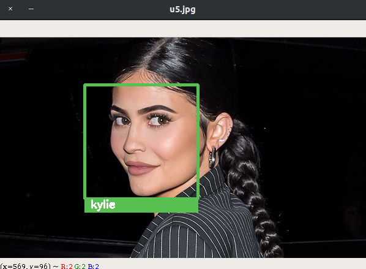
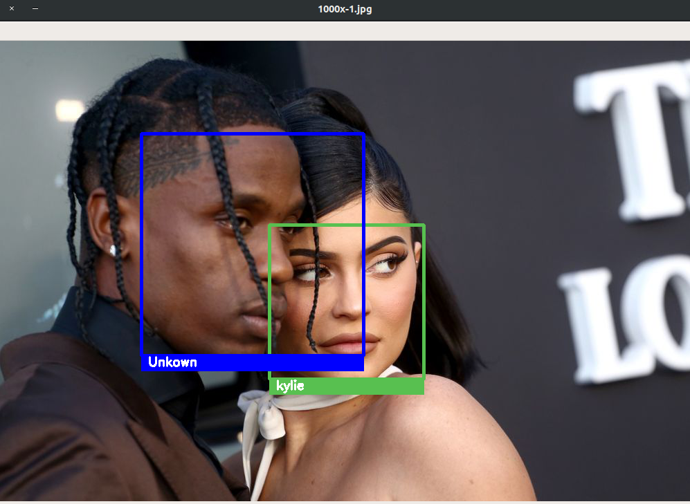

# Face Finder

#### Finds faces in images.

1. Clone the repo and remove the default images, if you wish to use your own
2. Place your images (must contain a single face) in ```known_faces``` with the correct label
3. Do a ```pip install -r requirements.txt``` 
4. Run ```recognize.py```

It can find faces in images quite accurately, but labelling them can done only if at least one image exists
with the proper labelled folder in ```known_faces```

## Screenshots


</br>
